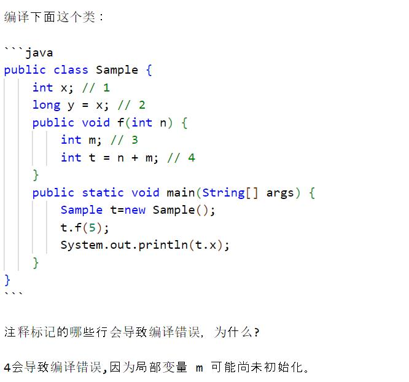
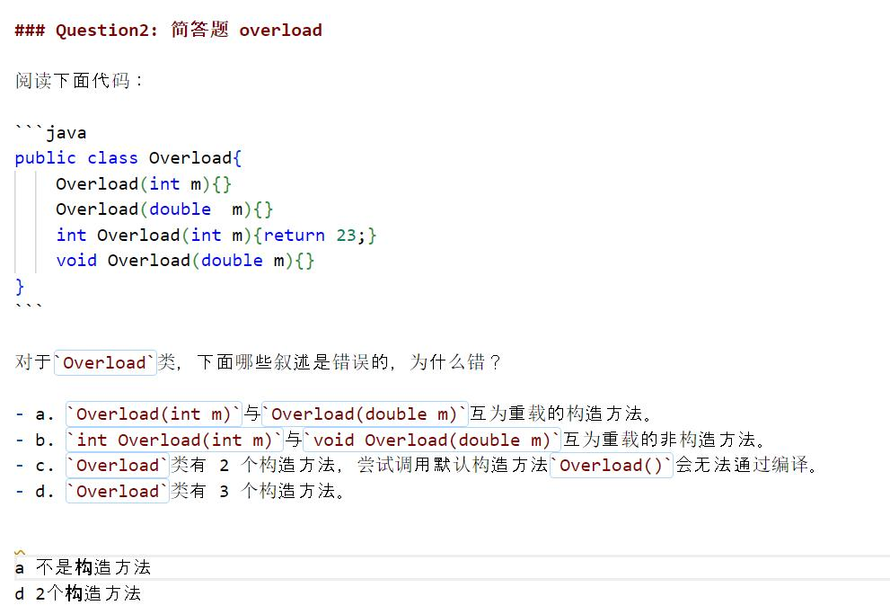
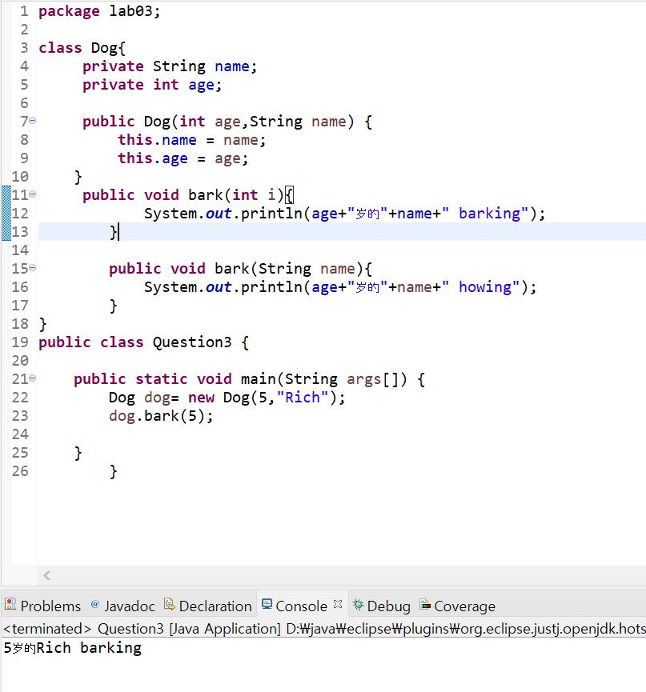
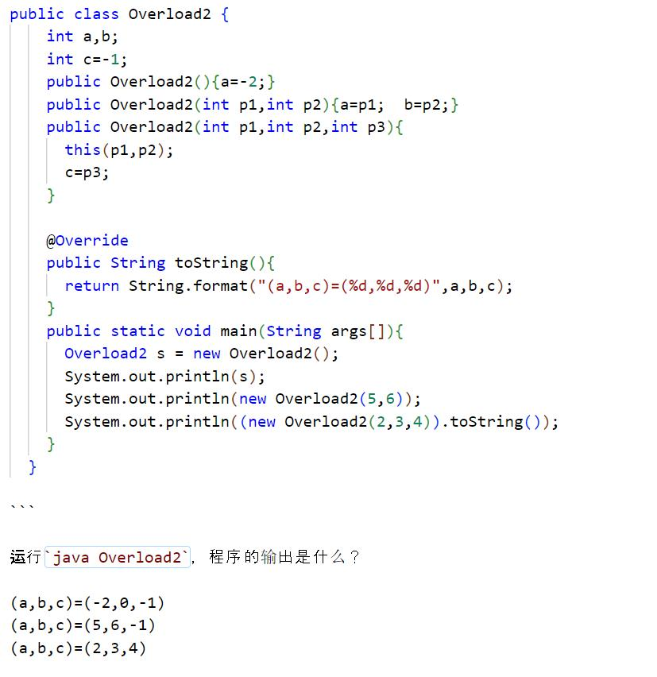
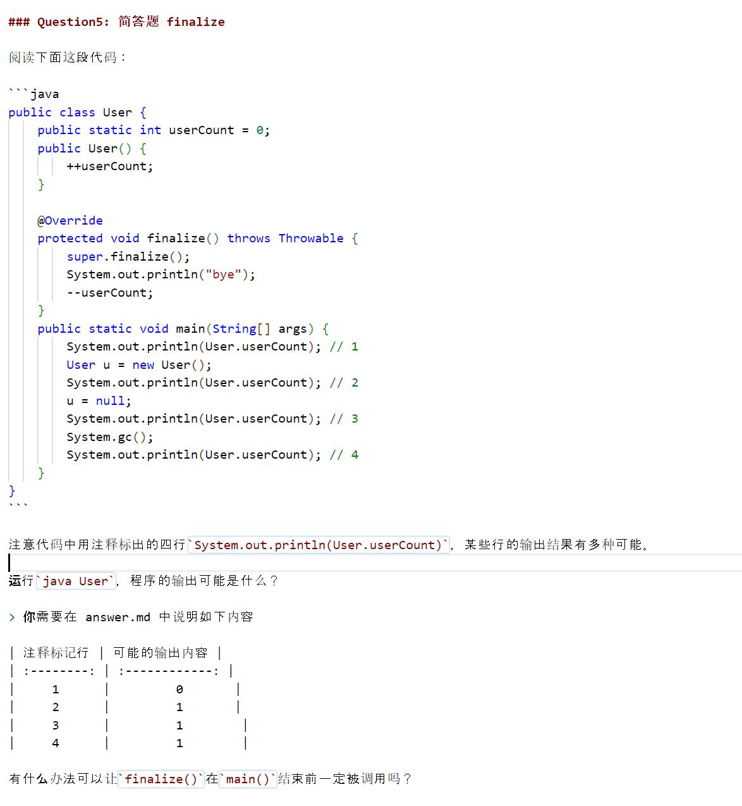
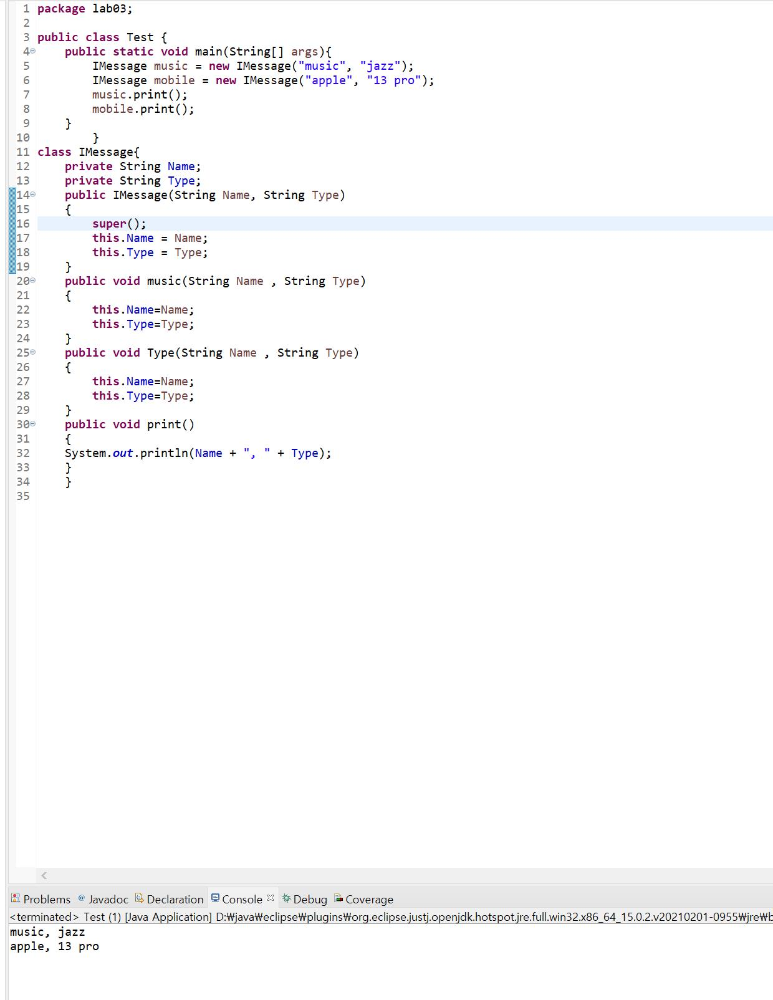
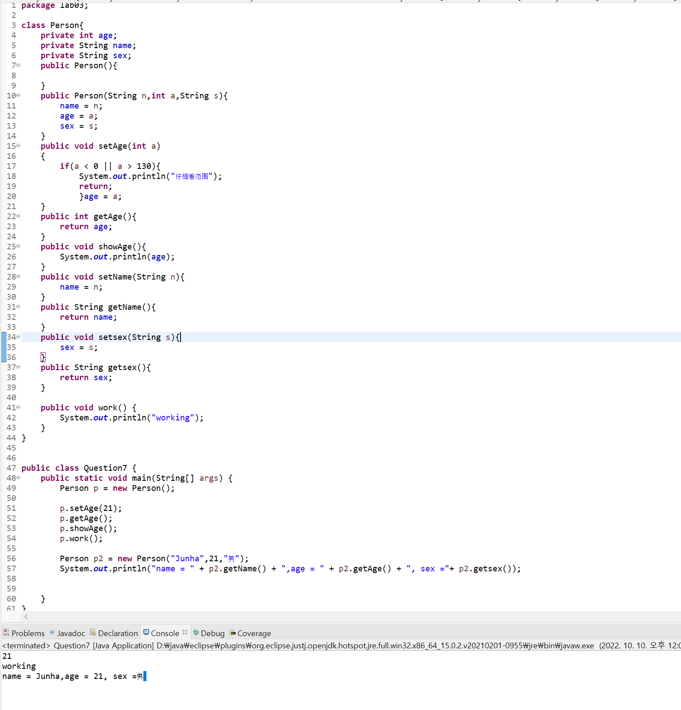
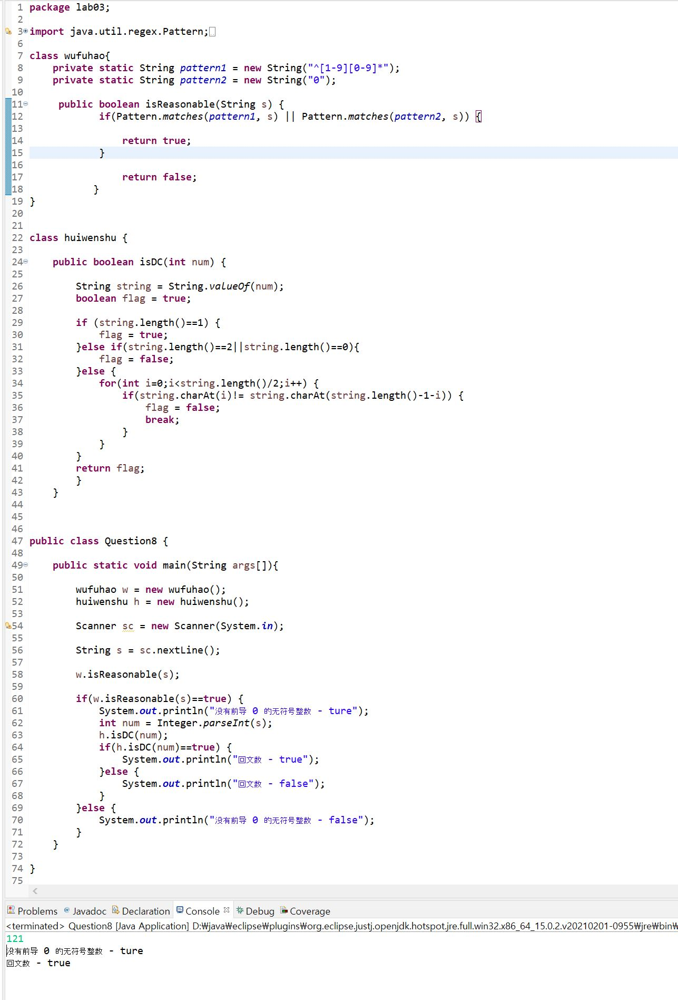

# Lab 03 Assignment

> 班级：
> 
> 学号：71216002
> 
> 姓名：金俊河

## 提交要求（以下内容在最终提交的作业中可以删除，仅作参考）

目录格式

```shell
-- 班级-学号-姓名-Lab03.zip
    |-- answer.pdf
    |-- solution
        |-- Question1
            |-- 题1的代码文件(如果需要)

        |-- Question2
            |-- 题2的代码文件(如果需要)
        |-- ...
```
## Question01

## Question02

## Question03

## Question04

## Question05

## Question06

## Question07

## Question08
